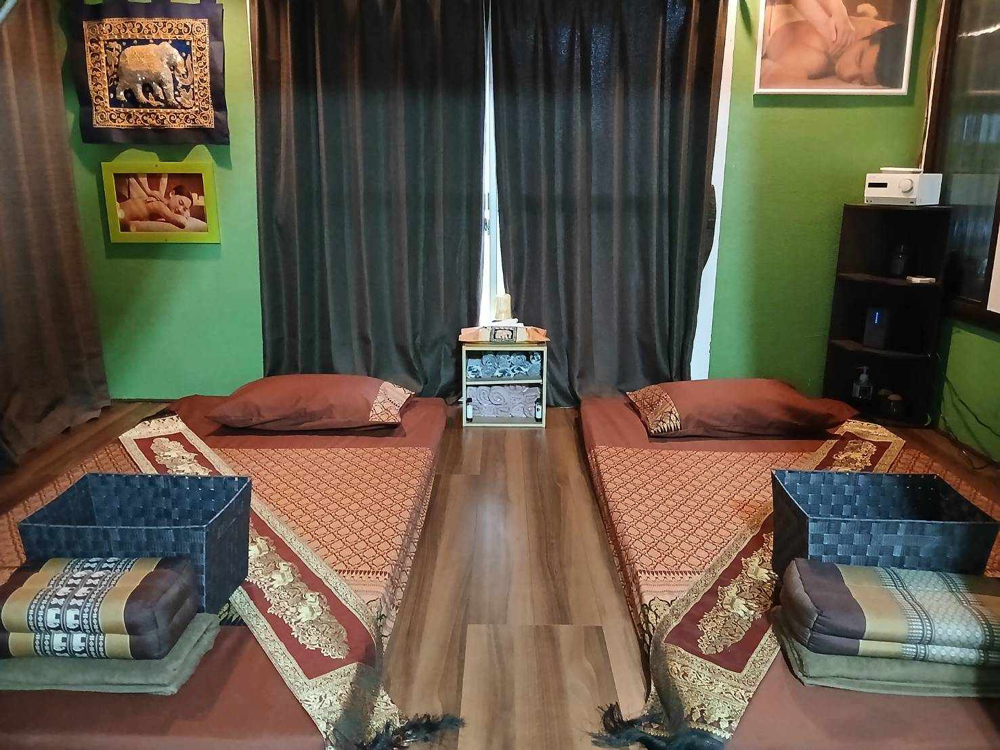

# 20250825_sabai

<html lang="ja" data-loaded="false" data-scrolled="false" data-spmenu="closed">
<head>

<meta charset="UTF-8">
<meta http-equiv="Content-Type" content="text/html; charset=UTF-8">
<meta http-equiv="X-UA-Compatible" content="IE=EmulateIE10" />
<meta http-equiv="X-UA-Compatible" content="IE=edge">

<meta name="viewport" content="width=device-width, initial-scale=1.0">

<!--ここから上はお決まりの定型文です-->

<!--ここからが表現の書式などを決めるcssという部分-->

<link href="https://cdnjs.cloudflare.com/ajax/libs/lightbox2/2.7.1/css/lightbox.css" rel="stylesheet">

</head>

<body>

モバイル端末をお使いの場合は、画面を横向きにすると
背景画像の横方向がご覧頂けます。

<!--ここ上は、ほぼそのまま使います！-->

<!--QRコードの挿入例-->

 LINEリンク用QRコード

<!--流れ文字の挿入例-->
<h1><marquee behavior="left">!!! 2025/08/27、タイ式マッサージ店「サバイ・サバイ」新装開店!!!</marquee></h1>

                          

<!--ここから下が、本体部分-->
    

 
<h2>2025年8月27日、タイ式マッサージ店「サバイ・サバイ」新装開店</h2>

    
<h2>マッサージスペース</h2>

    
<h2>店内受付</h2>

    
<h2>待合スペース</h2>

<h2>夜分帯のライトアップ</h2>

<h2>タッピング・マッサージ</h2>

    
<h2>マッサージの一般的な効果</h2>

<h2>店内の様子、画像クリックで拡大表示します↓</h2>

<h2>価格一覧表</h2>

  

<h2>営業時間、昼12:00~深夜24:00</h2>
<h2>マッサージ価格一覧 
     タイ古式マッサージ
     　　３０分　　２５００円
     　　６０分　　４５００円
     　　９０分　　６５００円
     　１２０分　　８５００円
 
     アロマ・オイル・マッサージ
     　　６０分　　６５００円
     　　９０分　　９５００円
     　１２０分　１２５００円
  
     タッピング・マッサージ
     　　６０分　　７５００円
     　　９０分　１００００円
     　１２０分　１３０００円
 
     足つぼ・マッサージ
     　　３０分　　２５００円
     　　６０分　　４５００円
</h2>

  
<h2>お店の場所はこちら 左上の「拡大地図を表示」クリックでGoogleMapsが立ち上がります↓</h2>

<iframe src="https://www.google.com/maps/embed?pb=!1m18!1m12!1m3!1d11434.578654670633!2d139.89983026869427!3d36.55366641016513!2m3!1f0!2f0!3f0!3m2!1i1024!2i768!4f13.1!3m3!1m2!1s0x601f67ace62ba69b%3A0x8a22c3f62c657eab!2z44K_44Kk44Oe44OD44K144O844K444O744OB44Kn44Oz44Oe44Kk!5e0!3m2!1sja!2sth!4v1756174740589!5m2!1sja!2sth" width="600" height="450" style="border:0;" allowfullscreen="" loading="lazy" referrerpolicy="no-referrer-when-downgrade"></iframe>

  
<h2>駐車場は店舗南側のスペース</h2>

         

    

   
<h2>ご予約・お問い合わせ等は、  080-2580-8186 までお願いします。  最上段のLINEリンクQRコードからは定期的に最新情報をお届けします。</h2>

     

         

  

      

<!--本体はここまで-->

<!--画面に空白地帯を作って、背景が見えるようにしています-->
                                              

<!-- フッタ -->
<footer>

Copyright 2025/08/25 Utsunomiya, Japan

</footer>

<!--HPにさまざまなJavaScriptを呼び込むための書式-->

    
    </body>
    
</html>
